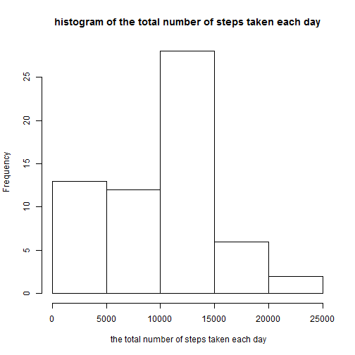
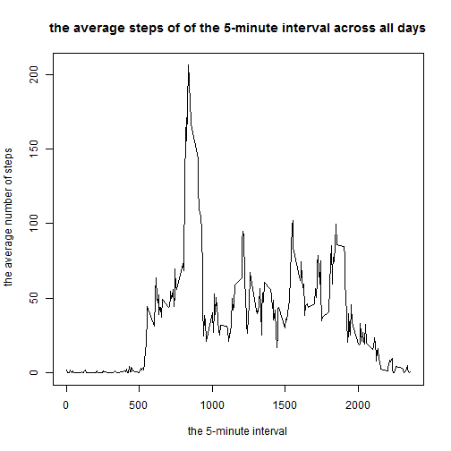
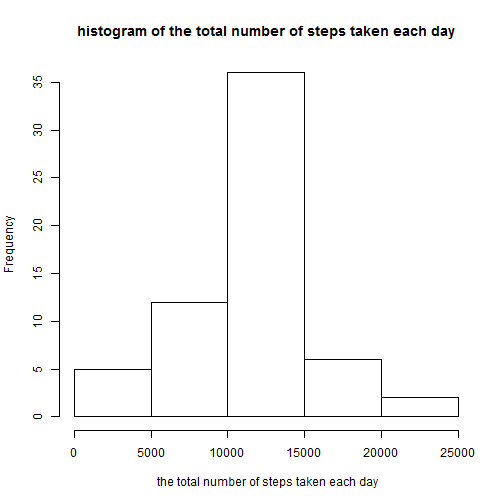

# Reproducible Research: Peer Assessment 1


## Loading and preprocessing the data

```r
setwd('D:/doc/study/dataScientists/5-Reproducible Research/RepData_PeerAssessment1/activity')
library(data.table)
active<-data.table(read.csv("./activity.csv"))
summary(active)
```

```
##      steps               date          interval   
##  Min.   :  0.0   2012-10-01:  288   Min.   :   0  
##  1st Qu.:  0.0   2012-10-02:  288   1st Qu.: 589  
##  Median :  0.0   2012-10-03:  288   Median :1178  
##  Mean   : 37.4   2012-10-04:  288   Mean   :1178  
##  3rd Qu.: 12.0   2012-10-05:  288   3rd Qu.:1766  
##  Max.   :806.0   2012-10-06:  288   Max.   :2355  
##  NA's   :2304    (Other)   :15840
```


## What is mean total number of steps taken per day?
Calculate the summary total number of steps every day

```r
step_sum<-active[,sum(steps,na.rm=TRUE),by=date]
setnames(step_sum, "V1", "date_sum")
summary(step_sum)
```

```
##          date       date_sum    
##  2012-10-01: 1   Min.   :    0  
##  2012-10-02: 1   1st Qu.: 6778  
##  2012-10-03: 1   Median :10395  
##  2012-10-04: 1   Mean   : 9354  
##  2012-10-05: 1   3rd Qu.:12811  
##  2012-10-06: 1   Max.   :21194  
##  (Other)   :55
```


```r
hist(step_sum$date_sum, main="histogram of the total number of steps taken each day", xlab=" the total number of steps taken each day")
```

 

Calculate  the mean and median total number of steps taken per day:

```r
mean(step_sum$date_sum, na.rm=TRUE)
```

```
## [1] 9354
```

```r
median(step_sum$date_sum, na.rm=TRUE)
```

```
## [1] 10395
```

## What is the average daily activity pattern?
Calculate the average steps in 5 minutes interval cross all day

```r
interval_average<-active[,mean(steps,na.rm=TRUE),by=interval]
setnames(interval_average, "V1", "interval_mean")
summary(interval_average)
```

```
##     interval    interval_mean   
##  Min.   :   0   Min.   :  0.00  
##  1st Qu.: 589   1st Qu.:  2.49  
##  Median :1178   Median : 34.11  
##  Mean   :1178   Mean   : 37.38  
##  3rd Qu.:1766   3rd Qu.: 52.83  
##  Max.   :2355   Max.   :206.17
```

Make a time series plot (i.e. type = "l") of the 5-minute interval (x-axis) and the average number of steps taken, averaged across all days (y-axis)

```r
plot(interval_average,type='l', main="the average steps of of the 5-minute interval across all days",xlab="the 5-minute interval",ylab=" the average number of steps")
```

 

Which 5-minute interval, on average across all the days in the dataset, contains the maximum number of steps

```r
subset(interval_average,interval_mean==max(interval_average$interval_mean))
```

```
##    interval interval_mean
## 1:      835         206.2
```

## Imputing missing values
Calculate and report the total number of missing values in the dataset (i.e. the total number of rows with NAs)

```r
na_step<-subset(active, is.na(steps))
summary(na_step)
```

```
##      steps              date        interval   
##  Min.   : NA    2012-10-01:288   Min.   :   0  
##  1st Qu.: NA    2012-10-08:288   1st Qu.: 589  
##  Median : NA    2012-11-01:288   Median :1178  
##  Mean   :NaN    2012-11-04:288   Mean   :1178  
##  3rd Qu.: NA    2012-11-09:288   3rd Qu.:1766  
##  Max.   : NA    2012-11-10:288   Max.   :2355  
##  NA's   :2304   (Other)   :576
```

filling in the missing values in the dataset with the mean for that 5-minute interval

```r
dt<-subset(merge(na_step, interval_average, by="interval"), TRUE,select=c(interval_mean, date, interval))
setnames(dt, "interval_mean", "steps")
active_clean<-rbind(subset(active, !is.na(steps)), dt)
summary(active_clean)
```

```
##      steps               date          interval   
##  Min.   :  0.0   2012-10-01:  288   Min.   :   0  
##  1st Qu.:  0.0   2012-10-02:  288   1st Qu.: 589  
##  Median :  0.0   2012-10-03:  288   Median :1178  
##  Mean   : 37.4   2012-10-04:  288   Mean   :1178  
##  3rd Qu.: 27.0   2012-10-05:  288   3rd Qu.:1766  
##  Max.   :806.0   2012-10-06:  288   Max.   :2355  
##                  (Other)   :15840
```

Calculate the summary total number of steps every day

```r
step_sum_clean<-active_clean[,sum(steps,na.rm=TRUE),by=date]
setnames(step_sum_clean, "V1", "date_sum")

hist(step_sum_clean$date_sum, main="histogram of the total number of steps taken each day", xlab=" the total number of steps taken each day")
```

 

Calculate  the mean and median total number of steps taken per day:

```r
mean(step_sum_clean$date_sum, na.rm=TRUE)
```

```
## [1] 10766
```

```r
median(step_sum_clean$date_sum, na.rm=TRUE)
```

```
## [1] 10766
```

these values differ from the estimates from the first part of the assignment. The impact of imputing missing data on the estimates of the total daily number of steps make the mean change bigger.

## Are there differences in activity patterns between weekdays and weekends?
Create a new factor variable in the dataset with two levels – “weekday” and “weekend” indicating whether a given date is a weekday or weekend day

```r
Sys.setlocale("LC_TIME", "English_Australia.1252")
active_clean[,w:=factor(ifelse(weekdays(as.Date(date),abbreviate=TRUE) %in% c("Sat","Sun"), "weekend","weekday"))]
```

Make a panel plot containing a time series plot (i.e. type = "l") of the 5-minute interval (x-axis) and the average number of steps taken, averaged across all weekday days or weekend days (y-axis).


```r
library(reshape2)
stepsmelt<-melt(active_clean,id.vars=c("w","interval"), measure="steps")
steps_mean<-dcast(stepsmelt, w+interval~variable, fun=mean)

library(lattice)
xyplot(steps ~ interval | w, data = steps_mean,type='l', layout = c(1, 2), ylab="number of steps")
```

 

